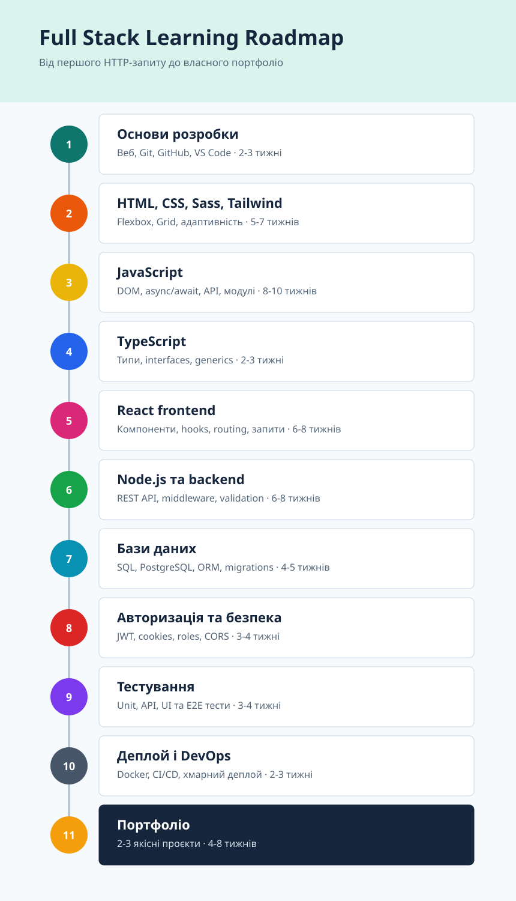

# Full Stack Learning Roadmap

Практична дорожня карта для вивчення full-stack розробки з нуля до рівня junior developer.

> Рухайтесь послідовно: опануйте тему, закріпіть її практикою та завершіть етап невеликим готовим проєктом.

## Візуальна карта

### Вертикальна версія

GitHub показує SVG у README як зображення, тому переходи між окремими зонами карти тут недоступні. Використовуйте навігацію за етапами нижче.

## Навчальні гілки

Кожен етап має окрему папку з матеріалами та практикою. Усі етапи доступні в провіднику одночасно.

### 1. [Основи розробки](01-development-foundations)

### 2. [HTML та CSS](02-html-css)

### 3. [Sass](sass)

### 4. [JavaScript](03-javascript)

### 5. [TypeScript](04-typescript)

### 6. [Tailwind CSS](tailwind)

### 7. [React frontend](05-react-frontend)

### 8. [Node.js та backend](06-nodejs-backend)

### 9. [Бази даних](07-databases)

### 10. [Авторизація та безпека](08-authentication-security)

### 11. [Тестування](09-testing)

### 12. [Деплой і DevOps](10-deployment-devops)

### 13. [Портфоліо](11-portfolio)

---

## Як навчатись

1. Рухайтесь за етапами від першого до тринадцятого.
2. Приділяйте приблизно 70% часу практиці та 30% теорії.
3. Після кожного етапу завершуйте готову функцію або невеликий проєкт.

## Повний план

### Основи розробки

**Тривалість:** 2-3 тижні

**Вивчити:** як працює веб: браузер, HTTP, DNS, клієнт/сервер; Git і GitHub; VS Code; командний рядок.

**Результат:** GitHub-профіль і перший репозиторій.

### HTML та CSS

**Тривалість:** 4-6 тижнів

**Вивчити:** семантичний HTML, форми, CSS selectors, box model, Flexbox, Grid, responsive design і accessibility.

**Результат:** адаптивний сайт-візитка та лендінг.

### Sass

**Тривалість:** 1-2 тижні

**Вивчити:** SCSS, змінні, вкладені правила, mixins, `@use` і структуру стилів.

**Результат:** CSS-проєкт, організований у модулі SCSS.

### JavaScript

**Тривалість:** 8-10 тижнів

**Вивчити:** типи, функції, масиви, об'єкти, DOM, події, async/await, Promise, fetch, modules, обробку помилок.

**Результат:** To-do app і погодний застосунок через API.

### TypeScript

**Тривалість:** 2-3 тижні

**Вивчити:** типи, interfaces, generics, union types, типізацію API та компонентів.

**Результат:** перепис одного JavaScript-проєкту на TypeScript.

### Tailwind CSS

**Тривалість:** 1-2 тижні

**Вивчити:** utility-класи, адаптивні модифікатори, states, теми та доступні компоненти.

**Результат:** адаптивний інтерфейс, створений Tailwind CSS.

### React frontend

**Тривалість:** 6-8 тижнів

**Вивчити:** компоненти, props, state, hooks, routing, forms, Context, роботу з API, React Query або TanStack Query.

**Результат:** SPA: каталог товарів, блог або трекер задач.

### Node.js та backend

**Тривалість:** 6-8 тижнів

**Вивчити:** Node.js, npm, Express або NestJS, REST API, middleware, валідацію, логування, структуру проєкту.

**Результат:** API для власного React-проєкту.

### Бази даних

**Тривалість:** 4-5 тижнів

**Вивчити:** SQL, PostgreSQL, таблиці, зв'язки, індекси, migrations; ORM: Prisma або Drizzle.

**Результат:** backend з PostgreSQL і CRUD.

### Авторизація та безпека

**Тривалість:** 3-4 тижні

**Вивчити:** password hashing, JWT, cookies, refresh tokens, roles, CORS, rate limiting, validation, environment variables.

**Результат:** реєстрація, логін і ролі користувачів.

### Тестування

**Тривалість:** 3-4 тижні

**Вивчити:** unit-тести з Vitest або Jest, API-тести, React Testing Library, базове E2E-тестування з Playwright.

**Результат:** API та ключові UI-сценарії, покриті тестами.

### Деплой і DevOps

**Тривалість:** 2-3 тижні

**Вивчити:** Docker, CI/CD через GitHub Actions, Vercel або Netlify для frontend, Render, Railway чи Fly.io для backend, PostgreSQL у хмарі.

**Результат:** повністю задеплоєний full-stack застосунок.

### Портфоліо

**Тривалість:** 4-8 тижнів

**Вивчити:** архітектуру, документацію, README, UI/UX, роботу з багами та code review.

**Результат:** 2-3 якісні проєкти на GitHub.

---

## Рекомендований стек

**Frontend:** HTML, CSS, Sass, Tailwind CSS, JavaScript, TypeScript, React, React Router, TanStack Query.

**Backend:** Node.js, Express або NestJS, REST API.

**Database:** PostgreSQL + Prisma.

**Auth:** JWT у HTTP-only cookies.

**Tools:** Git, GitHub, VS Code, Postman або Bruno, Docker.

**Deploy:** Vercel + Render або Railway + Neon чи Supabase PostgreSQL.

## Порядок навчання

1. Не переходьте до React, доки не зможете самостійно зробити кілька невеликих застосунків на чистому JavaScript.
2. Не починайте складний backend, доки не розумієте HTTP, `fetch`, JSON, async/await і структуру REST API.
3. Вивчайте SQL до ORM: Prisma має спрощувати роботу з базою даних, а не замінювати її розуміння.
4. Після кожного нового блоку робіть практичний проєкт і публікуйте його на GitHub.

## Проєкти для портфоліо

### Task Manager

React + Node.js + PostgreSQL: авторизація, задачі, статуси, дедлайни та фільтри.

### E-commerce mini shop

Каталог, пошук, кошик, замовлення та адмін-панель.

### Full-stack блог

Авторизація, статті, коментарі, ролі автора й адміністратора, завантаження зображень.

### Фінансовий трекер

Категорії витрат, графіки, фільтри за датою та експорт даних.

## Тривалість навчання

За умови навчання приблизно 2 години на день, 5-6 днів на тиждень, реалістично досягти рівня junior full-stack developer за **9-12 місяців**.

> Кожен тиждень завершуйте невеликою готовою функцією або проєктом, а не лише переглядом уроків.
